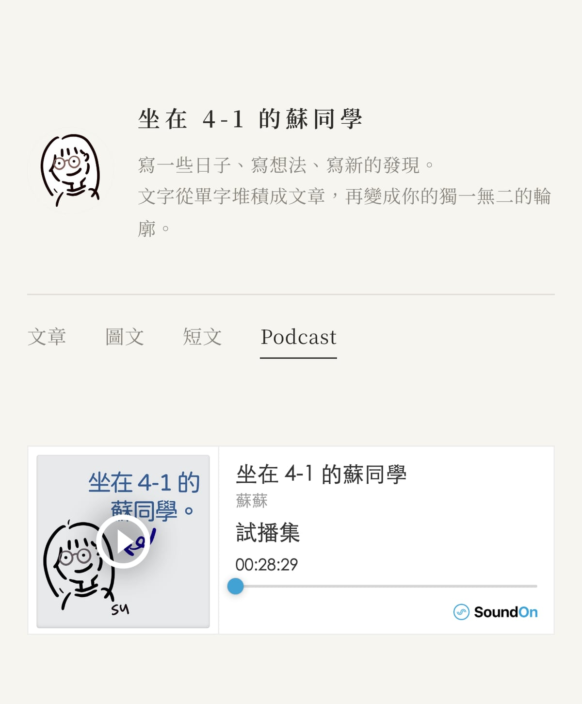
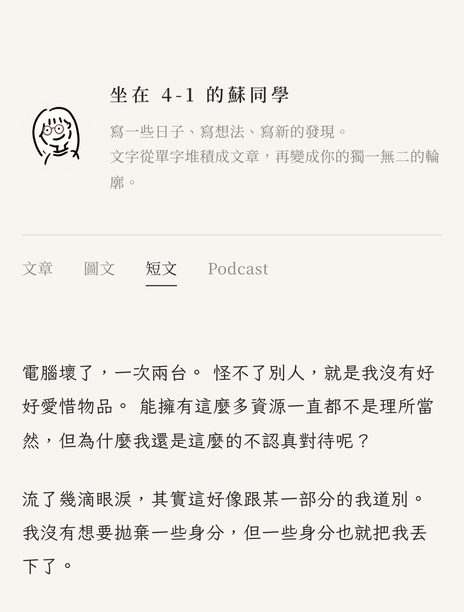
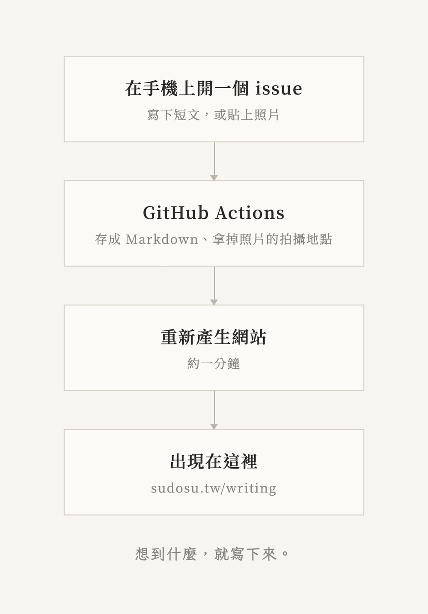
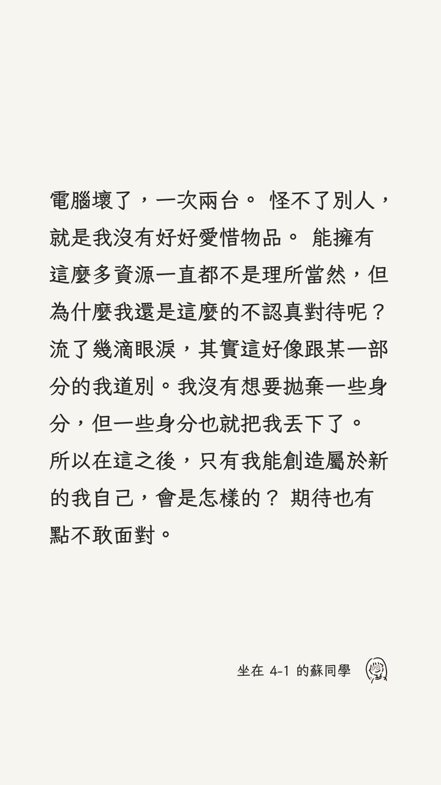

一直想要一個地方，放一些字、一些照片。不用跟著演算法走，也不用去想會被多少人看見。

昨天晚上，終於動手了。這個網站是和 AI 一起，一句一句對話做出來的。

## 先決定它的樣子

一開始只說了幾個條件：簡約、安靜，不要任何 emoji。分成三個分頁，文章、圖文、短文。短文像推特那樣一則一則接下去，只留下發布的日期與時間；圖文像 Instagram 的相片牆。

所有內容都是資料夾裡的 Markdown 檔，沒有後台，也沒有資料庫。寫好的字被預先排成一頁一頁的網頁，放在 GitHub Pages 上。

上面放了自己畫的小人當頭貼，旁邊是名字和一段描述，像一個小小的個人頁。

## 字

字體換了幾次。內文用思源宋體，短文用芫荽。芫荽是一套開源、可以商用的繁體字型，筆畫帶一點手寫的溫度。短文本來就是隨手寫下的句子，用它剛剛好。

## 一個模板，和一個自己

做到一半發現，這個網站其實可以變成一個模板，讓別人也拿去用。所以拆成了兩個地方：quiet-pages 是乾淨的模板，什麼內容都沒有；writing 是我自己的角落。模板之後長出新功能，這裡只要拉一下就有。

把網站加到手機的主畫面以後，它看起來就像一個 App。icon 是那個小人，名字叫「蘇同學」。

## 用手機寫字

這是我最喜歡的部分。

想到什麼的時候，打開手機上的 GitHub，開一個 issue，寫下來，送出。大約一分鐘後，它就變成這裡的一則短文。圖文也一樣，貼上照片、寫一段說明就好；照片裡的拍攝地點會被自動拿掉。

這個功能做好沒幾分鐘，我就從手機送出了第一則短文。

## 把一句話帶走

最後加了一個小東西：在這裡選取一段文字，按下「做成圖片」，它就會變成一張限時動態尺寸的圖片，可以直接分享到 Instagram。字是芫荽，右下角是我的頭貼。

另外也開了一個 Podcast 分頁，放進了試播集。

---

一個晚上，從一個空的資料夾，到一個可以隨時寫字的地方。

接下來，就是好好寫了。
