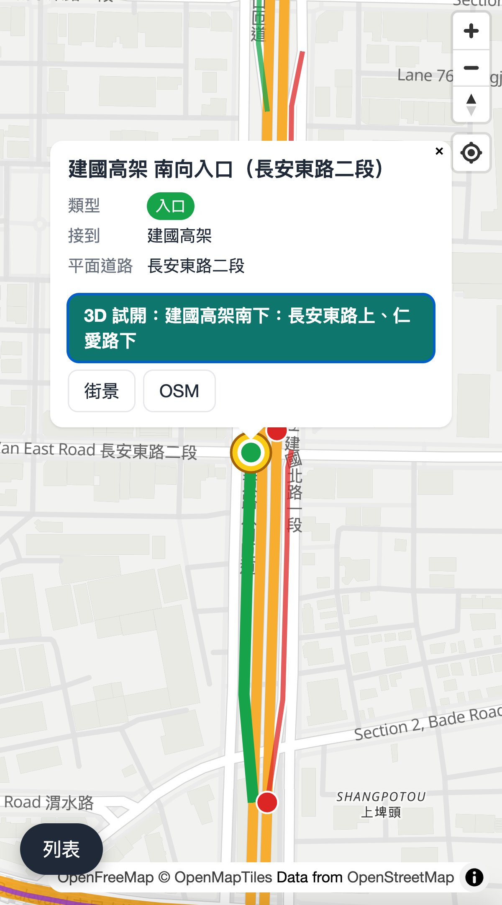
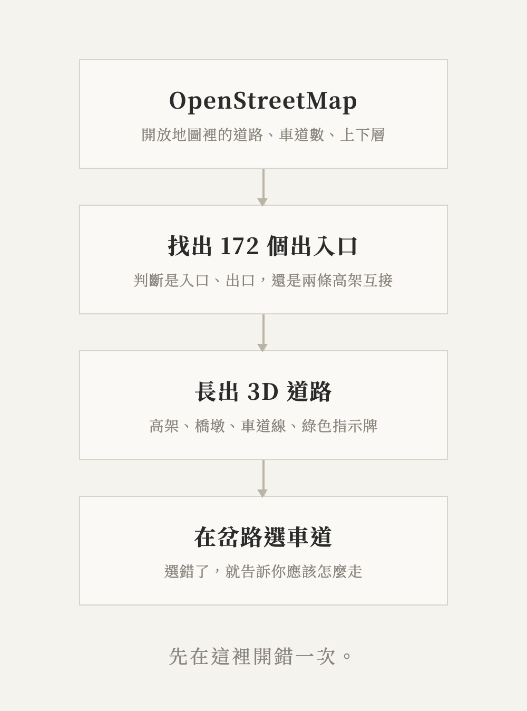
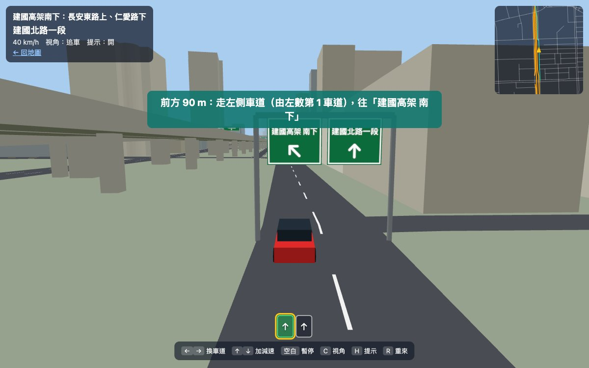
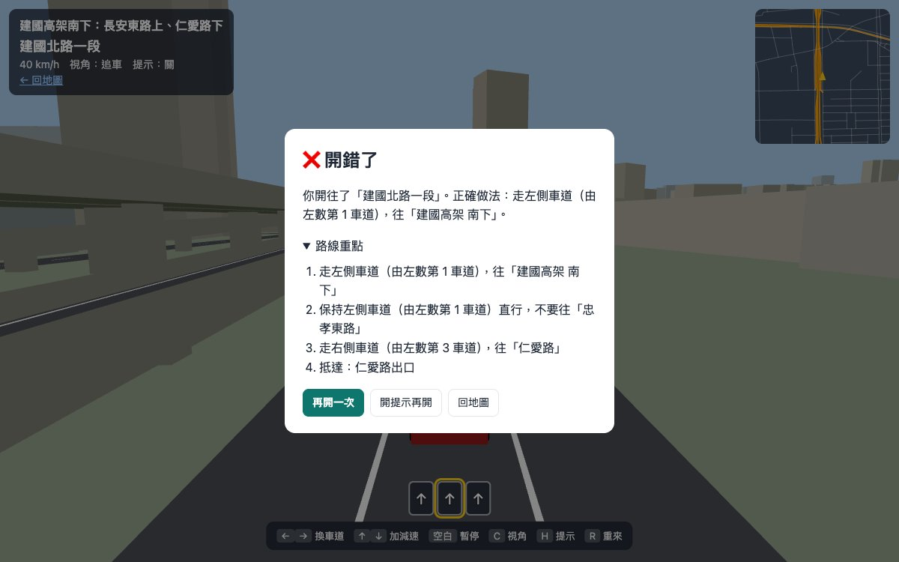

在台北開過幾次車之後，發現自己很容易開錯路。

不是不會開，是來不及。導航說「靠左上高架」的時候，左邊已經是一排車；看到綠色的牌子，才發現入口早就在前面分出去了。一錯過，就要繞一大圈回來，有時候還不小心上了另一條高架。

台北的高架很多，出入口擠在一起。有的入口在左邊，有的在右邊；有的出口緊接著下一個出口。第一次開的人，很難在幾秒鐘內判斷。

## 一個朋友的建議

跟一個也在台北開車的朋友聊起這件事，他說他也一樣，後來的做法是：出門前，先把常用的那幾個出入口看過一遍。

看過一遍，到了現場就不會慌。知道入口在左邊，就會提早靠左；知道下一個出口不要下，就不會被右邊的車道帶走。

只是，要「看過一遍」其實不容易。地圖是平面的，看不出哪一條是高架、哪一條在下面；街景要一格一格點，點到一半就迷路了。

所以我想，如果有一個網站：

在台北的地圖上，標出每一個高架的出入口。點下去，可以看到它的 3D 模樣，然後直接試開一次。

## 先有一張地圖

地圖上現在有 172 個出入口，涵蓋建國高架、市民高架、新生高架、環河、水源、信義快速道路，還有國道 1 號、國道 3 號在台北市的部分。

綠色是入口，紅色是出口，藍色是兩條高架之間互接的系統匝道。點一下，會告訴你它接到哪裡，旁邊還有街景的連結。

## 它是怎麼長出來的

這些資料沒有一筆是手動輸入的。

台北的道路，在 OpenStreetMap 這個開放地圖裡，已經被很多人一條一條畫好了，連車道數、哪一條路在上層、哪一條在下層都有。網站做的事，是把相連的匝道找出來，判斷它是入口還是出口，再依照上下層的關係，把道路長成 3D 的高架、橋墩和車道線。

這個網站也和上一個一樣，是和 AI 一起，一句一句對話做出來的。一個晚上，有了地圖、有了第一條可以開的路線，也開好了接下來要做的事情清單。

## 開開看

第一條可以試開的路線是：從長安東路口上建國高架往南，經過市民高架和忠孝東路出口都不要下，在仁愛路出口下來。

車子會自己往前開。你只需要做一件事：決定走哪一條車道。

快到岔路的時候，上方會出現綠色的指示牌，畫面下方是每一條車道往哪裡。提示會告訴你前面多遠、該靠哪一邊。

這是我自己試開時才發現的：這個入口在**左邊**。如果照著平常的習慣靠右，就直接錯過了。

## 開錯也沒關係

這裡最好的地方，是可以放心開錯。

走錯車道，網站會停下來，告訴你剛剛開去了哪裡、正確應該怎麼走，然後讓你再開一次。

開過一兩次之後，可以關掉提示，用「挑戰」模式再開一次，看看自己是不是真的記住了。

在網頁上開錯，只要按一下重來。在路上開錯，就是十幾分鐘。

## 它還不夠準

有一件事要先說清楚。

3D 的道路、每一條車道往哪裡、指示牌上寫什麼，都是程式從開放地圖「推算」出來的。開放地圖裡大多沒有記錄「第幾條車道可以去哪裡」，所以程式只能用道路的形狀去猜；牌子上的字，也不一定和現場一樣。

這些，程式沒辦法自己確認。需要有人去看一眼現場，或是看一眼街景。

## 需要你的幫忙

所以我把需要人做的事情，整理成一張一張的清單，放在 GitHub 上。每一張都寫了要做什麼、怎麼做、做完交什麼。**不需要會寫程式**，大部分只要在留言區填好表格就可以。

- **[用街景確認建國高架試開路線的 3 個岔路](https://github.com/susutw/taipei-ramp-sim/issues/3)**：每個岔路有幾條車道、哪一條往哪裡、牌子上寫什麼。這是現在最需要的，大約一個小時。
- **[列出最容易開錯的 20 個出入口](https://github.com/susutw/taipei-ramp-sim/issues/1)**：你或你身邊的人，在哪裡開錯過？大家都在哪裡迷路？這會決定下一條路線要做哪裡。
- **[校對建國高架 28 個出入口的名稱與方向](https://github.com/susutw/taipei-ramp-sim/issues/2)**：名稱是程式取的，有些方向會錯，有些路名駕駛看不懂。對著街景一個一個看，大約一兩個小時。
- **[用手機實際測試](https://github.com/susutw/taipei-ramp-sim/issues/4)**：用你的 iPhone 或 Android 打開網站開一次，告訴我順不順、按鈕好不好按。大約二十分鐘。

所有的進度都在[這一頁](https://github.com/susutw/taipei-ramp-sim/issues/10)。

如果你也是那個常常錯過出入口的人，那就更歡迎了。你開錯的地方，可能正是下一個人最需要先看一遍的地方。

---

網站在這裡：[sudosu.tw/taipei-ramp-sim](https://sudosu.tw/taipei-ramp-sim/)

接下來，會讓地圖上大部分的出入口都能直接試開。

下次上高架之前，先在這裡開一遍。
